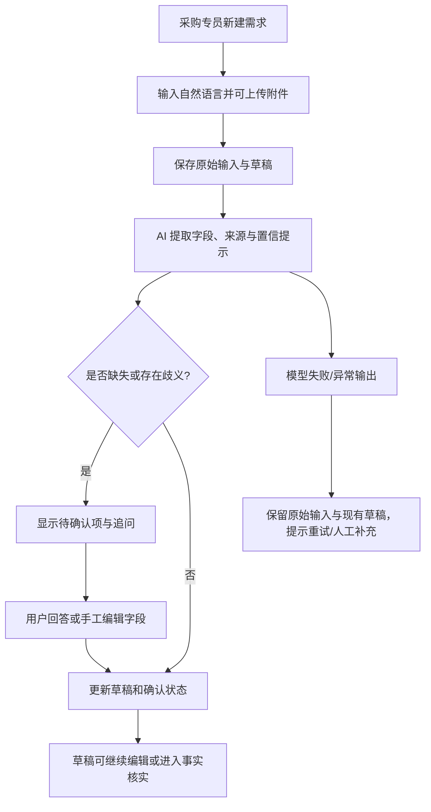
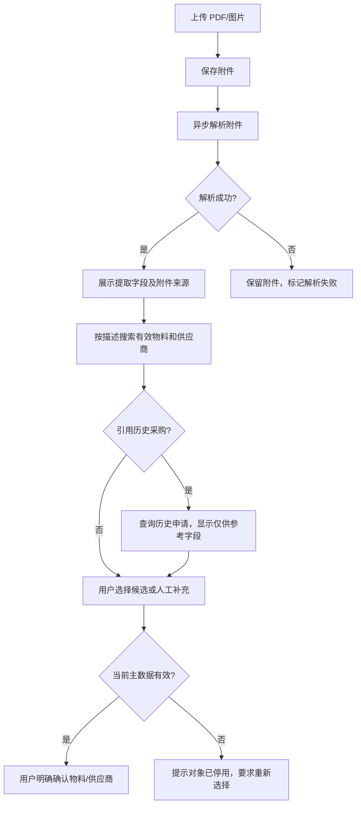
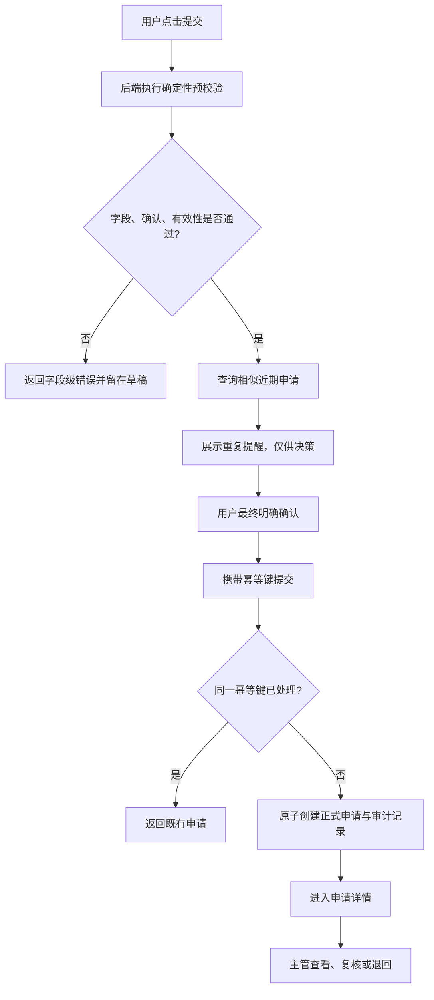

# 场景 1：需求分析

## 分析范围与原则

本分析以 `1-需求/场景1.md` 为唯一业务输入。系统的边界是“辅助形成采购申请”：AI 可提取、归纳、推荐与追问；正式物料、供应商、最终字段和提交动作均由用户确认及确定性后端规则控制。

角色：采购专员（创建、编辑、确认、提交）、采购主管（查看、复核、退回）、管理员（维护物料/供应商主数据、查看审计）。

## 业务流程一：从非结构化需求形成可编辑草稿

### 功能需求

|编号|需求|
|---|---|
|F1.1|采购专员可创建多个独立草稿，录入原始文本、用途、期望日期、数量等任意初始信息。|
|F1.2|草稿保存 AI 对话、结构化字段、每个字段的来源（用户/附件/AI/历史）及确认状态。|
|F1.3|AI 返回字段建议、缺失项、歧义和追问；推断结果必须标为“待确认”，不能直接成为已确认事实。|
|F1.4|用户可逐项编辑、确认或撤销确认；编辑后对应字段重新变为待确认。|
|F1.5|用户可切换、刷新并恢复各自草稿。|

### 非功能需求

草稿自动保存应可感知且不丢数据；AI 调用需设置超时；不同用户的数据必须隔离；对话与编辑记录需可审计。

### 异常场景

模型超时、网络错误或无法解析输出时，不覆盖已确认字段，不丢失原文，并提供重试和手工补充入口；AI 返回晚于用户切换草稿时，只能写入原草稿。

### 技术约束

前端使用 Vue 生态，后端使用 Python 3；草稿以服务端 ID 为上下文键，AI 请求必须携带 `draftId` 和请求版本号；确认状态由后端保存。

### 验收标准

输入“下周要 200 个耐高温轴承，沿用之前品牌”后，可看到数量、单位、日期/物料/品牌候选及待确认标识；刷新后仍可恢复；模拟 AI 失败后原文和先前确认内容仍存在。

## 业务流程二：附件解析、主数据与历史采购事实确认

### 功能需求

|编号|需求|
|---|---|
|F2.1|支持上传 PDF、图片等采购附件，展示上传、解析中、成功、失败状态。|
|F2.2|附件提取型号、规格、数量、报价、供应商等候选；候选明确标记附件来源和待核实状态。|
|F2.3|可按关键字搜索当前有效物料、供应商，并查看编码、规格、品牌、状态等候选信息。|
|F2.4|可检索历史采购申请并引用其中的物料、规格、数量、品牌或供应商作为参考。|
|F2.5|用户必须显式选择当前有效的物料和供应商；系统记录选择与确认操作。|
|F2.6|管理员可维护物料、供应商主数据的启停状态。|

### 非功能需求

附件原件需可靠存储并受访问控制；解析任务应异步可重试；主数据查询失败不能影响草稿编辑；关键事实变更需留下审计记录。

### 异常场景

上传成功但解析失败时附件继续可下载、可重试；物料/供应商检索超时时保留查询条件与草稿；历史引用的对象已停用时禁止直接确认，要求重新选择。

### 技术约束

附件二进制与元数据分离保存；仅后端判定主数据有效性；历史申请是参考快照，联系人、预算、备注及失效对象不得自动带入最终值。

### 验收标准

上传一份无法解析的附件后仍可在草稿中看到该附件并人工补全；从历史申请选择停用供应商时系统阻止确认；选中有效物料与供应商后，草稿显示编码和“已确认”。

## 业务流程三：校验、明确提交、复核与追溯

### 功能需求

|编号|需求|
|---|---|
|F3.1|提交前校验必填字段：物料、规格/型号、数量、单位、期望交期、用途；校验数量和日期格式。|
|F3.2|校验所选物料和供应商在提交时仍有效，且重要 AI/附件/历史推测已确认。|
|F3.3|查找近期相似申请并展示提示，用户可继续提交或返回修改。|
|F3.4|最终提交必须由用户二次确认；成功后创建正式申请、锁定提交快照并显示详情。|
|F3.5|支持用幂等键安全重试；同一草稿不会生成多张申请。|
|F3.6|详情展示最终内容、原始输入、附件和关键审计记录；主管可复核或退回并填写原因。|

### 非功能需求

正式申请创建需事务性和幂等性；审计记录不可被普通用户篡改；提交接口应具备认证、授权和可观测日志。

### 异常场景

预校验失败返回字段级提示且草稿保持可编辑；提交过程中重试返回同一申请；提交前主数据变为停用时拒绝提交；主管退回后保留原申请、原因与过程记录。

### 技术约束

提交校验与正式创建只能在 Python 后端完成；使用 `Idempotency-Key` 与草稿唯一约束；重复检测只能提醒，禁止 AI 或相似度服务自动拦截或提交。

### 验收标准

缺少交期时无法提交且收到字段错误；连续两次提交同一幂等键只生成一个申请号；申请详情可查看原始文本、附件、确认和提交审计；主管能够退回并留下原因。

## 数据对象概览

`Draft`（草稿）、`DraftField`（值/来源/确认状态）、`ConversationMessage`、`Attachment`、`Material`、`Supplier`、`PurchaseApplication`、`AuditLog`、`Submission`（幂等键与结果）是核心对象。正式申请保存提交瞬间的快照，不依赖之后被修改的主数据。
